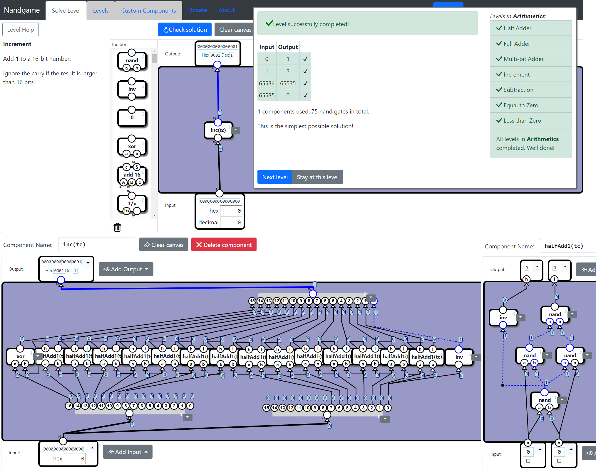
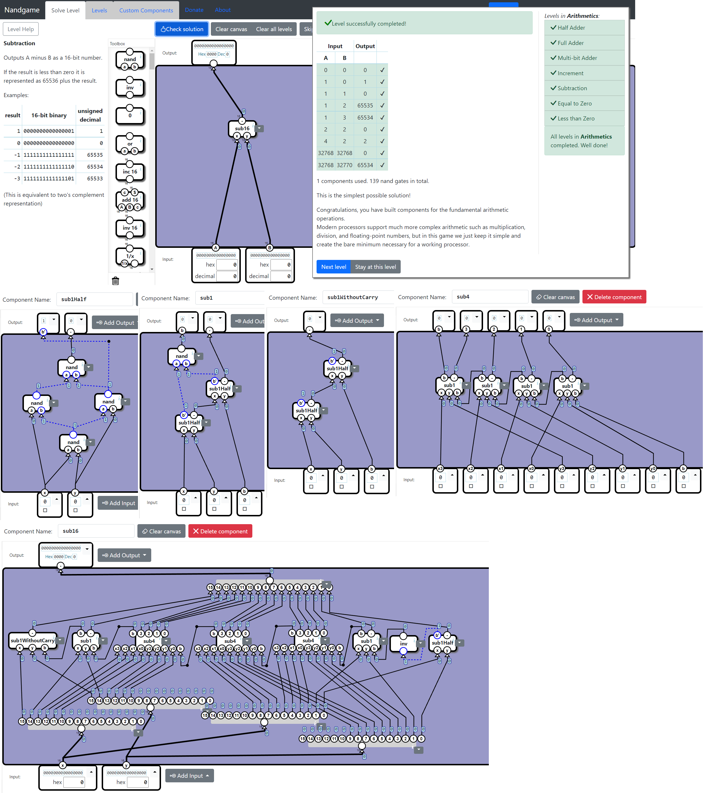
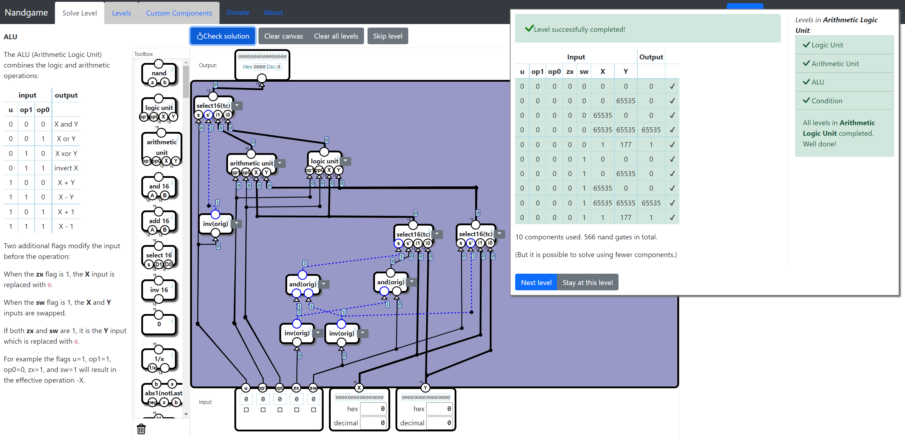
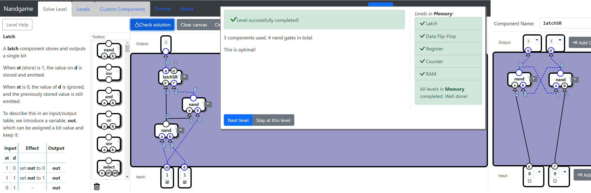
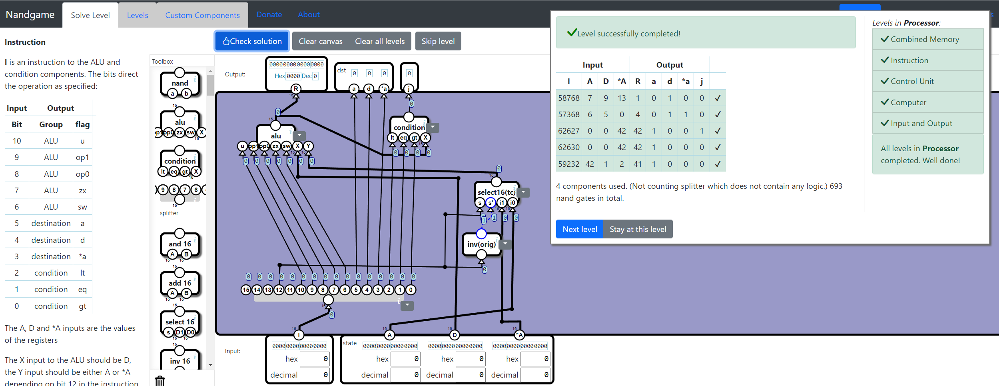
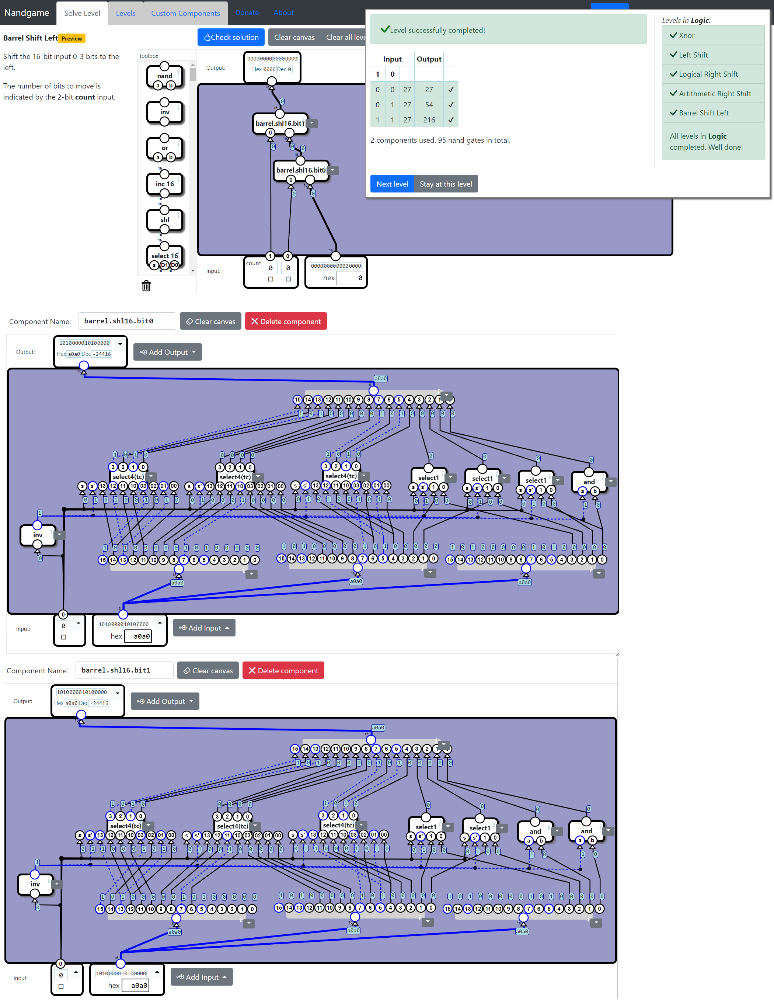
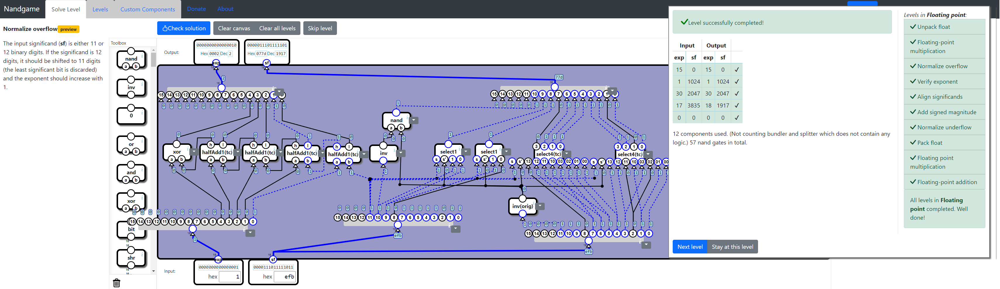
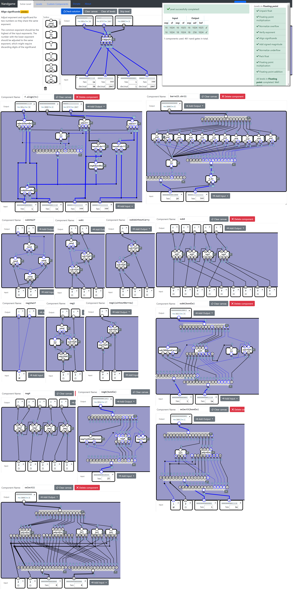
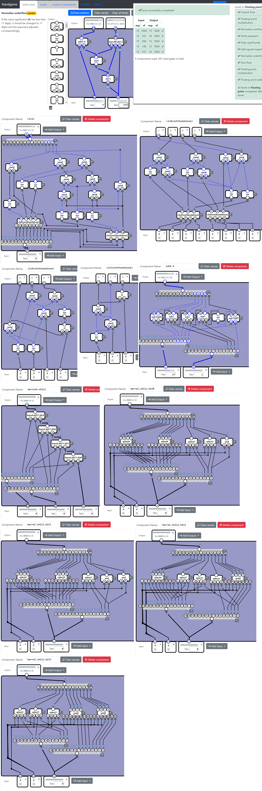

# Nandgame Solution

My solution of [nandgame.com](https://nandgame.com/).

## Table of contents

* [H.2.4 Increment (75 nands)](#h24-increment-75-nands)
* [H.2.5 Subtraction (139 nands)](#h25-subtraction-139-nands)
* [H.4.1 Logic Unit (183 nands)](#h41-logic-unit-183-nands)
* [H.4.2 Arithmetic Unit (211 nands)](#h42-arithmetic-unit-211-nands)
* [H.4.3 ALU (407 nands)](#h43-alu-407-nands)
* [H.4.4 Condition (50 nands)](#h44-condition-50-nands)
* [H.5.1 Latch (4 nands) Without "select1" Bug](#h51-latch-4-nands-without-select1-bug)
* [H.6.2 Instruction (506 nands)](#h62-instruction-506-nands)
* [H.6.3 Control Unit (563 nands)](#h63-control-unit-563-nands)
* [O.3.1 Max (106 nands)](#o31-max-106-nands)
* [O.2.5 Barrel Shift Left 4bits (181 nands)](#o25-barrel-shift-left-4bits-181-nands)
* [O.3.2 Multiplication (1404 nands)](#o32-multiplication-1404-nands)
* [O.4.1 Unary ALU (68 nands)](#o41-unary-alu-68-nands)
* [O.5.2 Floating-point multiplication (157 nands)](#o52-floating-point-multiplication-157-nands)
* [O.5.3 Normalize overflow (57 nands)](#o53-normalize-overflow-57-nands)
* [O.5.4 Verify exponent (41 nands)](#o54-verify-exponent-41-nands)
* [O.5.5 Align significands (327 nands)](#o55-align-significands-327-nands)
* [O.5.6 Add signed magnitude (213 nands)](#o56-add-signed-magnitude-213-nands)
* [O.5.7 Normalize underflow (207 nands)](#o57-normalize-underflow-207-nands)

```
******************************************************
*                                                    *
*                                                    *
*                                                    *
*                     Spoiler                        *
*                                                    *
*                     Warning                        *
*                                                    *
*                                                    *
*                                                    *
*                                                    *
*                                                    *
*                                                    *
*                     Spoiler                        *
*                                                    *
*                     Warning                        *
*                                                    *
*                                                    *
*                                                    *
*                                                    *
*                                                    *
*                                                    *
*                     Spoiler                        *
*                                                    *
*                     Warning                        *
*                                                    *
*                                                    *
*                                                    *
*                                                    *
*                                                    *
*                                                    *
*                     Spoiler                        *
*                                                    *
*                     Warning                        *
*                                                    *
*                                                    *
*                                                    *
*                                                    *
*                                                    *
*                                                    *
*                     Spoiler                        *
*                                                    *
*                     Warning                        *
*                                                    *
*                                                    *
*                                                    *
****************************************************** 
```

## H.2.4 Increment (75 nands)

Half-add is enough.



## H.2.5 Subtraction (139 nands)

We will re-use this in Optional Levels later.



## H.4.1 Logic Unit (183 nands)

LUT (Lookup Table) is a commenly used trick in FPGAs.


## H.4.2 Arithmetic Unit (211 nands)

A very special component to select between (y, 0, 1, y').


## H.4.3 ALU (407 nands)

* add16+c: 9 * 15 + 8 = 143
* decoder part1: 11
* decoder part2: 15
* decoder part3: 14
* select16: 48
* lut2x16: 9 * 16 = 144
* inv16x2: 32



## H.4.4 Condition (50 nands)

Splitting into data[15] and data[14:0] simplifies the logic.


## H.5.1 Latch (4 nands) Without "select1" Bug

A traditional [D latch](https://en.wikipedia.org/wiki/Flip-flop_(electronics)#Gated_D_latch).

Note: If you use "select1" in this level, unfortunately this is not correct in reality and can only exist in the game. If we expand the "select1" in this solution, we will find that the output is connected to an [SR nand latch](https://en.wikipedia.org/wiki/Flip-flop_(electronics)#SR_NAND_latch), in which it is illegal when S' = 0, R' = 0 at the same time.



## H.6.2 Instruction (506 nands)

* select16: 3 * 16 = 48 nands
* alu: 407 nands
* condition: 50 nands
* final: 1 + 48 + 407 + 50 = 506 nands



## H.6.3 Control Unit (563 nands)

* a or 1: 2 nands
* alu instruction: 506 nands
* other selectors: 1 + 3 * 16 + 2 * 3 = 55 nands
* final: 55 + 2 + 506 = 563 nands


## O.2.5 Barrel Shift Left 4bits (181 nands)

We exactly know which bits will become 0 and we can use "and" instead of "select".

* bit0: 1 + 3 * 15 + 2 * 1 = 48
* bit1: 1 + 3 * 14 + 2 * 2 = 47
* bit2: 1 + 3 * 12 + 2 * 4 = 45
* bit3: 1 + 3 * 8 + 2 * 8 = 41



## O.3.1 Max (106 nands)

Let high.lte and high.gte denote that a <= b and a >= b in the higher bits.
* Select a if gte && !lte;
* Select b if !gte && lte;
* Compare a and b if lte && gte.


## O.3.2 Multiplication (1404 nands)

This work implements a 16bits x 16bits = 16bits Vedic Multiplier. (I think someone else's answers were 8bits x 8bits = 16bits.)

Since the overflow bit should be discarded according to the question, two types of components are designed. "mul4\*4=4" omits the 4 overflow bits (and you may find this type of components are quite easy to understand). "mul4\*4=8" keeps the 4 carry bits.

* mul2\*2=2: 8 nands
* mul2\*2=4: 13 nands
* mul4\*4=4: "mul2\*2=4" * 1 + "mul2\*2=2" * 2 + fullAddWithoutCarry * 2 + halfAdd * 2 = 55 nands
* mul4\*4=8: "mul2\*2=4" * 4 + fullAdd * 6 + halfAdd * 3 + 7 = 128 nands
* mul8\*8=8: "mul4\*4=8" * 1 + "mul4\*4=4" * 2 + fullAddWithoutCarry * 2 + fullAdd * 4 + halfAdd * 2 = 300 nands
* mul8\*8=16: "mul4\*4=8" * 4 + add4 * 2 + fullAdd * 6 + halfAdd * 5 + 7 = 670 nands
* mul16\*16=16: "mul8\*8=16" * 1 + "mul8\*8=8" * 2 + fullAddWithoutCarry * 2 + add4 * 2 + fullAdd * 4 + halfAdd * 2 = 1404 nands


> Reference:
> 
> Bathija, Rajesh et al. “Low Power High Speed 16x16 bit Multiplier using Vedic Mathematics.” International Journal of Computer Applications 59 (2012): 41-44.

## O.4.1 Unary ALU (68 nands)

Pre-calculate the common parts.


## O.5.2 Floating-point multiplication (157 nands)

The max possible exp is 0x1e + 0x1e - 15 = 45. So the output is 6-bits. (X + Y - 15) = (X + Y + 0b110001).

The final nands showed by the game make no sense because the 11 x 11 = 22bits multiplcation is complicated. Anyway...


## O.5.3 Normalize overflow (57 nands)

* select1 * 10: 30 nands
* halfAdd1 * 4: 20 nands
* final: 20 + 4 + 1 + 30 + 2 = 57 nands



## O.5.5 Align significands (327 nands)

The largest difference in the exponent bit is 0x1e - 0x1 = 0x1d, which needs a 5-bits shift-right. Translate the result of sub5 into the 5-bits shift-right.

* sub5: 36 + 5 = 41
* select5: 3 * 5 = 15
* translate(+): 11
* translate(-): 25
* barrel.shr11.bit0: 2 * 1 + 3 * 10 = 32
* barrel.shr11.bit1: 2 * 2 + 3 * 9 = 31
* barrel.shr11.bit2: 2 * 4 + 3 * 7 = 29
* barrel.shr11.bit3: 2 * 8 + 3 * 3 = 25
* barrel4.shr11: 32 + 31 + 29 + 25 = 117
* final: 41 + 15 + 1 + 11 + 25 + 117 * 2 = 327



## O.5.4 Verify exponent (41 nands)


## O.5.6 Add signed magnitude (213 nands)

I first calculate gte (a >= b) and then one of (a + b), (a - b) and (b - a) in the same block. gte and addSubSwap has some common parts.

* selectors: 4 + 2 + 3 = 9
* addSubSwap: 8 + 13 * 9 + 8 = 133
* gte: 3 + 7 * 9 + 5 = 71


## O.5.7 Normalize underflow (207 nands)

I don't actually know what to do if the exponent is less than 1 after a left shift on a too small input number. This answer will return an underflow exponent in this case. (ex: exp = 1 and sf = 0x1ff.)

* clz4: 10
* clz8: clz4 * 2 + 10 = 30
* clz3: 6
* clz11: clz8 + clz3 + 14 = 50
* barrel.shl11.bit0: 3 * 10 + 2 * 1 = 32
* barrel.shl11.bit1: 3 * 9 + 2 * 2 = 31
* barrel.shl11.bit2: 3 * 7 + 2 * 4 = 29
* barrel.shl11.bit3: 3 * 3 + 2 * 8 = 25
* barrel4.shl: 117
* inv4: 4
* sub5-4: 4 + 9 * 3 + 5 = 36
* final: 50 + 117 + 4 + 36 = 207

More explain about clz11:
* clz4 returns   z' = 0,          y1' = 0, y0' = 0 if all inputs are 0.
* clz8 returns   z' = 0, y2' = 1, y1' = 0, y0' = 0 if all inputs are 0.
* clz3 returns   z' = 0,          y1' = 0, y0' = 1 if all inputs are 0.
* clz11 returns y3' = 1, y2' = 1, y1' = 1, y0' = 1 if all inputs are 0.


